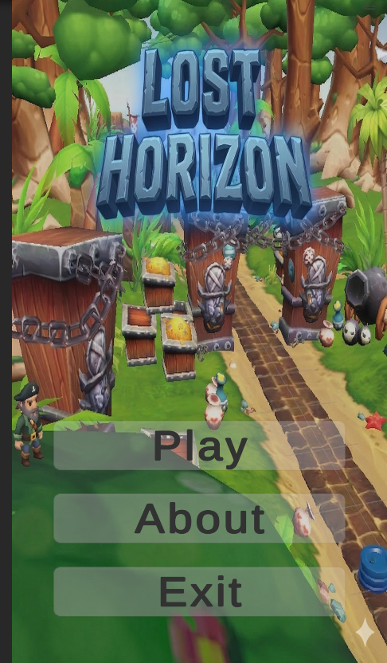
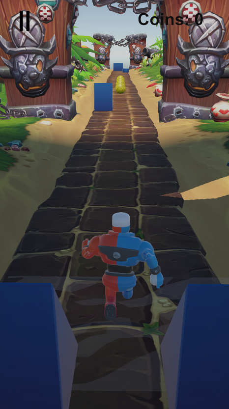
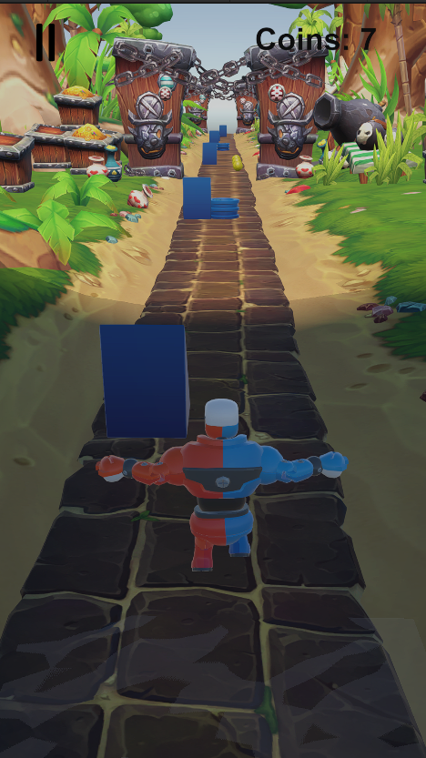
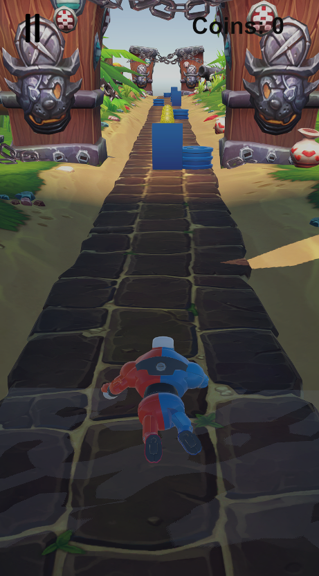
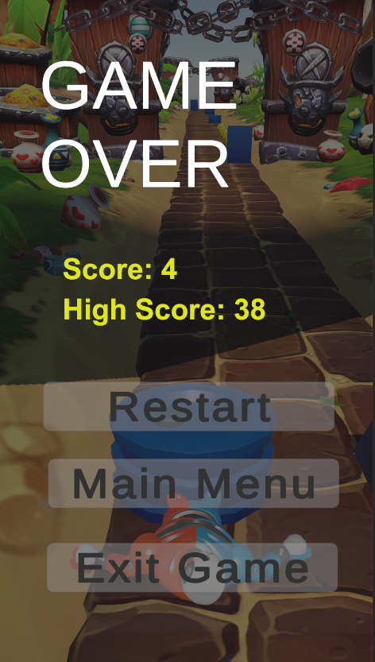
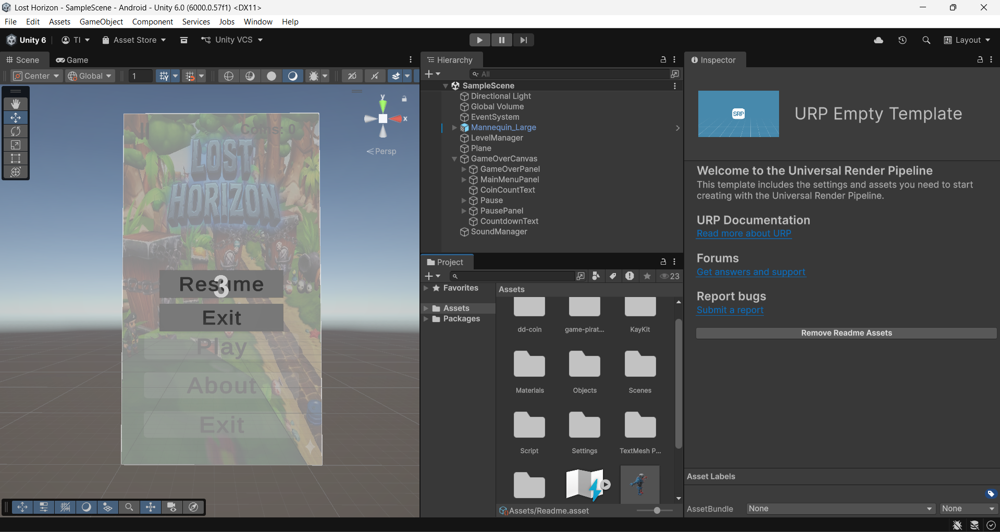

# Lost Horizon 🏃‍♂️💨

**Lost Horizon** is a high-octane 3D endless runner built with **Unity 6**. Navigate through a beautifully stylized world, dodge obstacles, and collect coins to set the ultimate high score.

---

## 🎮 Gameplay Preview
<p align="center">
  
</p>

## 📸 Gallery

<table style="width:100%">
  <tr>
    <td align="center" width="33%"><br><b>Main Menu</b></td>
    <td align="center" width="33%"><br><b>In-Game Action</b></td>
    <td align="center" width="33%"><br><b>In-Game Action</b></td>
  </tr>
  <tr>
    <td align="center" width="33%"><br><b>In-Game Action</b></td>
    <td align="center" width="33%"><br><b>Game Over</b></td>
    <td align="center" width="33%"><br><b>Asset Integration</b></td>
  </tr>
</table>

---

## ✨ Features
* **Dynamic Level Generation:** Procedurally spawning environments that keep the gameplay fresh and challenging.
* **Universal Render Pipeline (URP):** Optimized for high-fidelity graphics and smooth performance across different hardware.
* **Interactive UI:** Complete game loop including a Main Menu, Pause System, Countdown timer, and Game Over screens.
* **Score Tracking:** Real-time coin collection and high-score management.
* **Sound Management:** Integrated audio system for immersive background music and sound effects.

## 🛠️ Technical Stack
* **Engine:** Unity 6 (6000.0.5f1)
* **Scripting:** C#
* **Render Pipeline:** Universal Render Pipeline (URP)
* **Input System:** Legacy Input / New Input System (Cross-platform ready)

## 🧠 Technical Highlights: Key Scripts
* **`WorldGenerator.cs`**: Manages the procedural generation logic, spawning and recycling environment "tiles" to create an infinite path.
* **`StationaryPlayer.cs`**: Handles player movement, input detection, and collision logic with obstacles.
* **`CoinSpawner.cs` & `CoinAnimation.cs`**: A dedicated system to handle coin placement and smooth rotation/floating animations for collectibles.
* **`SoundManager.cs`**: A singleton-based audio controller to manage background music and SFX triggers across different game states.
* **`MainMenuManager.cs`**: Controls the UI transitions between the main menu, gameplay, and game-over states.

## 📂 Project Structure
* `Assets/Scripts`: Contains the core logic for the LevelManager, PlayerController, and SoundManager.
* `Assets/Scenes`: The main game world (SampleScene).
* `Assets/Settings`: URP configuration files for optimized lighting and performance.

## 🚀 Installation & Setup
1.  **Clone the Repository:**
    ```bash
    git clone [https://github.com/angadkumar28/Lost-Horizon.git](https://github.com/angadkumar28/Lost-Horizon.git)
    ```
2.  **Open in Unity:** Use Unity Hub to open the project folder using **Unity 6**.
3.  **Play:** Open `Assets/Scenes/SampleScene.unity` and press the **Play** button!

---

## 📜 Credits & Attributions
While the code and game logic were developed by me, the visual assets used in this project are from others talented creators.

*All assets are used under their respective CC0 or Attribution licenses for educational/portfolio purposes.*

---